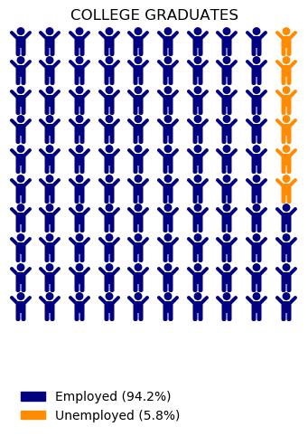
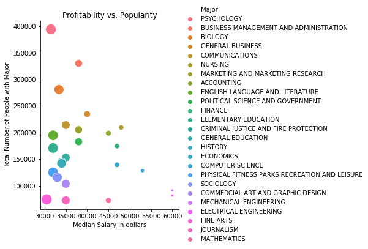
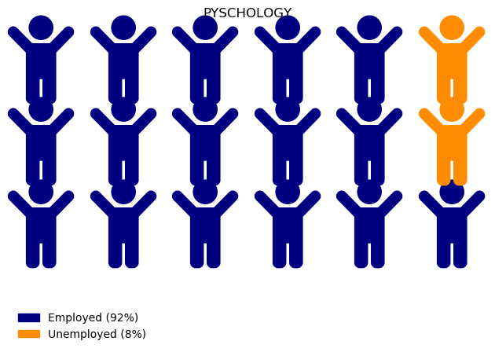
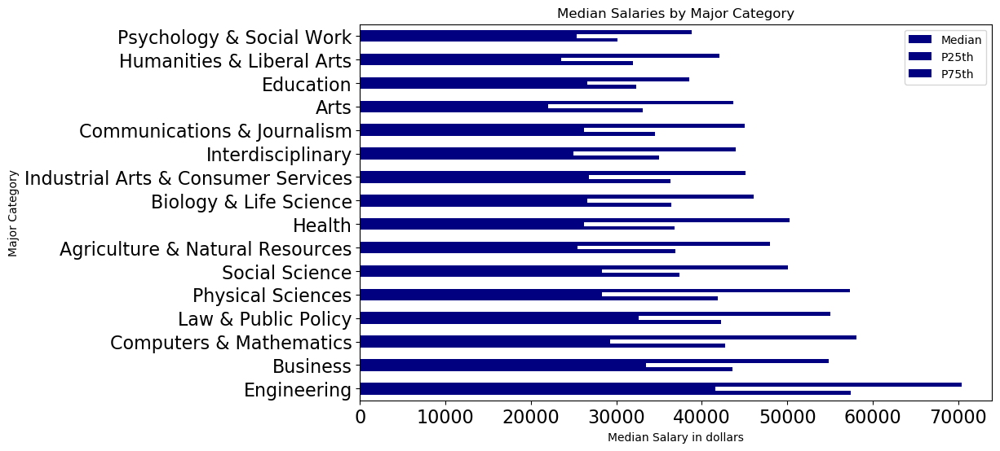

# The Economics of College Majors: Degrees that Pay you Back - Part 2

## Stephanie Fissel

## Install packages


```python
import pandas as pd
import matplotlib.pyplot as plt
from pywaffle import Waffle
import seaborn as sns
import matplotlib
```

### Install pywaffle package from matplotlib


```python
pip install pywaffle matplotlib
```

    Requirement already satisfied: pywaffle in ./anaconda3/lib/python3.7/site-packages (0.5.1)
    Requirement already satisfied: matplotlib in ./anaconda3/lib/python3.7/site-packages (3.1.0)
    Requirement already satisfied: cycler>=0.10 in ./anaconda3/lib/python3.7/site-packages (from matplotlib) (0.11.0)
    Requirement already satisfied: kiwisolver>=1.0.1 in ./anaconda3/lib/python3.7/site-packages (from matplotlib) (1.4.2)
    Requirement already satisfied: pyparsing!=2.0.4,!=2.1.2,!=2.1.6,>=2.0.1 in ./anaconda3/lib/python3.7/site-packages (from matplotlib) (3.0.9)
    Requirement already satisfied: python-dateutil>=2.1 in ./anaconda3/lib/python3.7/site-packages (from matplotlib) (2.8.2)
    Requirement already satisfied: numpy>=1.11 in ./anaconda3/lib/python3.7/site-packages (from matplotlib) (1.21.6)
    Requirement already satisfied: typing-extensions; python_version < "3.8" in ./anaconda3/lib/python3.7/site-packages (from kiwisolver>=1.0.1->matplotlib) (4.4.0)
    Requirement already satisfied: six>=1.5 in ./anaconda3/lib/python3.7/site-packages (from python-dateutil>=2.1->matplotlib) (1.16.0)
    Note: you may need to restart the kernel to use updated packages.


## Read in college majors dataset


```python
df = pd.read_csv('/Users/stephaniefissel/Downloads/archive (13)/recent-grads.csv')
```


```python
df.head()
```


<div>
<style scoped>
    .dataframe tbody tr th:only-of-type {
        vertical-align: middle;
    }

    .dataframe tbody tr th {
        vertical-align: top;
    }

    .dataframe thead th {
        text-align: right;
    }
</style>
<table border="1" class="dataframe">
  <thead>
    <tr style="text-align: right;">
      <th></th>
      <th>Rank</th>
      <th>Major_code</th>
      <th>Major</th>
      <th>Total</th>
      <th>Men</th>
      <th>Women</th>
      <th>Major_category</th>
      <th>ShareWomen</th>
      <th>Sample_size</th>
      <th>Employed</th>
      <th>...</th>
      <th>Part_time</th>
      <th>Full_time_year_round</th>
      <th>Unemployed</th>
      <th>Unemployment_rate</th>
      <th>Median</th>
      <th>P25th</th>
      <th>P75th</th>
      <th>College_jobs</th>
      <th>Non_college_jobs</th>
      <th>Low_wage_jobs</th>
    </tr>
  </thead>
  <tbody>
    <tr>
      <th>0</th>
      <td>1</td>
      <td>2419</td>
      <td>PETROLEUM ENGINEERING</td>
      <td>2339.0</td>
      <td>2057.0</td>
      <td>282.0</td>
      <td>Engineering</td>
      <td>0.120564</td>
      <td>36</td>
      <td>1976</td>
      <td>...</td>
      <td>270</td>
      <td>1207</td>
      <td>37</td>
      <td>0.018381</td>
      <td>110000</td>
      <td>95000</td>
      <td>125000</td>
      <td>1534</td>
      <td>364</td>
      <td>193</td>
    </tr>
    <tr>
      <th>1</th>
      <td>2</td>
      <td>2416</td>
      <td>MINING AND MINERAL ENGINEERING</td>
      <td>756.0</td>
      <td>679.0</td>
      <td>77.0</td>
      <td>Engineering</td>
      <td>0.101852</td>
      <td>7</td>
      <td>640</td>
      <td>...</td>
      <td>170</td>
      <td>388</td>
      <td>85</td>
      <td>0.117241</td>
      <td>75000</td>
      <td>55000</td>
      <td>90000</td>
      <td>350</td>
      <td>257</td>
      <td>50</td>
    </tr>
    <tr>
      <th>2</th>
      <td>3</td>
      <td>2415</td>
      <td>METALLURGICAL ENGINEERING</td>
      <td>856.0</td>
      <td>725.0</td>
      <td>131.0</td>
      <td>Engineering</td>
      <td>0.153037</td>
      <td>3</td>
      <td>648</td>
      <td>...</td>
      <td>133</td>
      <td>340</td>
      <td>16</td>
      <td>0.024096</td>
      <td>73000</td>
      <td>50000</td>
      <td>105000</td>
      <td>456</td>
      <td>176</td>
      <td>0</td>
    </tr>
    <tr>
      <th>3</th>
      <td>4</td>
      <td>2417</td>
      <td>NAVAL ARCHITECTURE AND MARINE ENGINEERING</td>
      <td>1258.0</td>
      <td>1123.0</td>
      <td>135.0</td>
      <td>Engineering</td>
      <td>0.107313</td>
      <td>16</td>
      <td>758</td>
      <td>...</td>
      <td>150</td>
      <td>692</td>
      <td>40</td>
      <td>0.050125</td>
      <td>70000</td>
      <td>43000</td>
      <td>80000</td>
      <td>529</td>
      <td>102</td>
      <td>0</td>
    </tr>
    <tr>
      <th>4</th>
      <td>5</td>
      <td>2405</td>
      <td>CHEMICAL ENGINEERING</td>
      <td>32260.0</td>
      <td>21239.0</td>
      <td>11021.0</td>
      <td>Engineering</td>
      <td>0.341631</td>
      <td>289</td>
      <td>25694</td>
      <td>...</td>
      <td>5180</td>
      <td>16697</td>
      <td>1672</td>
      <td>0.061098</td>
      <td>65000</td>
      <td>50000</td>
      <td>75000</td>
      <td>18314</td>
      <td>4440</td>
      <td>972</td>
    </tr>
  </tbody>
</table>
<p>5 rows × 21 columns</p>
</div>


## Sort 25 most popular majors


```python
df.sort_values('Total', ascending=False).head(25)
```


<div>
<style scoped>
    .dataframe tbody tr th:only-of-type {
        vertical-align: middle;
    }

    .dataframe tbody tr th {
        vertical-align: top;
    }

    .dataframe thead th {
        text-align: right;
    }
</style>
<table border="1" class="dataframe">
  <thead>
    <tr style="text-align: right;">
      <th></th>
      <th>Rank</th>
      <th>Major_code</th>
      <th>Major</th>
      <th>Total</th>
      <th>Men</th>
      <th>Women</th>
      <th>Major_category</th>
      <th>ShareWomen</th>
      <th>Sample_size</th>
      <th>Employed</th>
      <th>...</th>
      <th>Part_time</th>
      <th>Full_time_year_round</th>
      <th>Unemployed</th>
      <th>Unemployment_rate</th>
      <th>Median</th>
      <th>P25th</th>
      <th>P75th</th>
      <th>College_jobs</th>
      <th>Non_college_jobs</th>
      <th>Low_wage_jobs</th>
    </tr>
  </thead>
  <tbody>
    <tr>
      <th>145</th>
      <td>146</td>
      <td>5200</td>
      <td>PSYCHOLOGY</td>
      <td>393735.0</td>
      <td>86648.0</td>
      <td>307087.0</td>
      <td>Psychology &amp; Social Work</td>
      <td>0.779933</td>
      <td>2584</td>
      <td>307933</td>
      <td>...</td>
      <td>115172</td>
      <td>174438</td>
      <td>28169</td>
      <td>0.083811</td>
      <td>31500</td>
      <td>24000</td>
      <td>41000</td>
      <td>125148</td>
      <td>141860</td>
      <td>48207</td>
    </tr>
    <tr>
      <th>76</th>
      <td>77</td>
      <td>6203</td>
      <td>BUSINESS MANAGEMENT AND ADMINISTRATION</td>
      <td>329927.0</td>
      <td>173809.0</td>
      <td>156118.0</td>
      <td>Business</td>
      <td>0.473190</td>
      <td>4212</td>
      <td>276234</td>
      <td>...</td>
      <td>50357</td>
      <td>199897</td>
      <td>21502</td>
      <td>0.072218</td>
      <td>38000</td>
      <td>29000</td>
      <td>50000</td>
      <td>36720</td>
      <td>148395</td>
      <td>32395</td>
    </tr>
    <tr>
      <th>123</th>
      <td>124</td>
      <td>3600</td>
      <td>BIOLOGY</td>
      <td>280709.0</td>
      <td>111762.0</td>
      <td>168947.0</td>
      <td>Biology &amp; Life Science</td>
      <td>0.601858</td>
      <td>1370</td>
      <td>182295</td>
      <td>...</td>
      <td>72371</td>
      <td>100336</td>
      <td>13874</td>
      <td>0.070725</td>
      <td>33400</td>
      <td>24000</td>
      <td>45000</td>
      <td>88232</td>
      <td>81109</td>
      <td>28339</td>
    </tr>
    <tr>
      <th>57</th>
      <td>58</td>
      <td>6200</td>
      <td>GENERAL BUSINESS</td>
      <td>234590.0</td>
      <td>132238.0</td>
      <td>102352.0</td>
      <td>Business</td>
      <td>0.436302</td>
      <td>2380</td>
      <td>190183</td>
      <td>...</td>
      <td>36241</td>
      <td>138299</td>
      <td>14946</td>
      <td>0.072861</td>
      <td>40000</td>
      <td>30000</td>
      <td>55000</td>
      <td>29334</td>
      <td>100831</td>
      <td>27320</td>
    </tr>
    <tr>
      <th>93</th>
      <td>94</td>
      <td>1901</td>
      <td>COMMUNICATIONS</td>
      <td>213996.0</td>
      <td>70619.0</td>
      <td>143377.0</td>
      <td>Communications &amp; Journalism</td>
      <td>0.669999</td>
      <td>2394</td>
      <td>179633</td>
      <td>...</td>
      <td>49889</td>
      <td>116251</td>
      <td>14602</td>
      <td>0.075177</td>
      <td>35000</td>
      <td>27000</td>
      <td>45000</td>
      <td>40763</td>
      <td>97964</td>
      <td>27440</td>
    </tr>
    <tr>
      <th>34</th>
      <td>35</td>
      <td>6107</td>
      <td>NURSING</td>
      <td>209394.0</td>
      <td>21773.0</td>
      <td>187621.0</td>
      <td>Health</td>
      <td>0.896019</td>
      <td>2554</td>
      <td>180903</td>
      <td>...</td>
      <td>40818</td>
      <td>122817</td>
      <td>8497</td>
      <td>0.044863</td>
      <td>48000</td>
      <td>39000</td>
      <td>58000</td>
      <td>151643</td>
      <td>26146</td>
      <td>6193</td>
    </tr>
    <tr>
      <th>77</th>
      <td>78</td>
      <td>6206</td>
      <td>MARKETING AND MARKETING RESEARCH</td>
      <td>205211.0</td>
      <td>78857.0</td>
      <td>126354.0</td>
      <td>Business</td>
      <td>0.615727</td>
      <td>2684</td>
      <td>178862</td>
      <td>...</td>
      <td>35829</td>
      <td>127230</td>
      <td>11663</td>
      <td>0.061215</td>
      <td>38000</td>
      <td>30000</td>
      <td>50000</td>
      <td>25320</td>
      <td>93889</td>
      <td>27968</td>
    </tr>
    <tr>
      <th>40</th>
      <td>41</td>
      <td>6201</td>
      <td>ACCOUNTING</td>
      <td>198633.0</td>
      <td>94519.0</td>
      <td>104114.0</td>
      <td>Business</td>
      <td>0.524153</td>
      <td>2042</td>
      <td>165527</td>
      <td>...</td>
      <td>27693</td>
      <td>123169</td>
      <td>12411</td>
      <td>0.069749</td>
      <td>45000</td>
      <td>34000</td>
      <td>56000</td>
      <td>11417</td>
      <td>39323</td>
      <td>10886</td>
    </tr>
    <tr>
      <th>137</th>
      <td>138</td>
      <td>3301</td>
      <td>ENGLISH LANGUAGE AND LITERATURE</td>
      <td>194673.0</td>
      <td>58227.0</td>
      <td>136446.0</td>
      <td>Humanities &amp; Liberal Arts</td>
      <td>0.700898</td>
      <td>1436</td>
      <td>149180</td>
      <td>...</td>
      <td>57825</td>
      <td>81180</td>
      <td>14345</td>
      <td>0.087724</td>
      <td>32000</td>
      <td>23000</td>
      <td>41000</td>
      <td>57690</td>
      <td>71827</td>
      <td>26503</td>
    </tr>
    <tr>
      <th>78</th>
      <td>79</td>
      <td>5506</td>
      <td>POLITICAL SCIENCE AND GOVERNMENT</td>
      <td>182621.0</td>
      <td>93880.0</td>
      <td>88741.0</td>
      <td>Social Science</td>
      <td>0.485930</td>
      <td>1387</td>
      <td>133454</td>
      <td>...</td>
      <td>43711</td>
      <td>83236</td>
      <td>15022</td>
      <td>0.101175</td>
      <td>38000</td>
      <td>28000</td>
      <td>50000</td>
      <td>36854</td>
      <td>66947</td>
      <td>19803</td>
    </tr>
    <tr>
      <th>35</th>
      <td>36</td>
      <td>6207</td>
      <td>FINANCE</td>
      <td>174506.0</td>
      <td>115030.0</td>
      <td>59476.0</td>
      <td>Business</td>
      <td>0.340825</td>
      <td>2189</td>
      <td>145696</td>
      <td>...</td>
      <td>21463</td>
      <td>108595</td>
      <td>9413</td>
      <td>0.060686</td>
      <td>47000</td>
      <td>35000</td>
      <td>64000</td>
      <td>24243</td>
      <td>48447</td>
      <td>9910</td>
    </tr>
    <tr>
      <th>138</th>
      <td>139</td>
      <td>2304</td>
      <td>ELEMENTARY EDUCATION</td>
      <td>170862.0</td>
      <td>13029.0</td>
      <td>157833.0</td>
      <td>Education</td>
      <td>0.923745</td>
      <td>1629</td>
      <td>149339</td>
      <td>...</td>
      <td>37965</td>
      <td>86540</td>
      <td>7297</td>
      <td>0.046586</td>
      <td>32000</td>
      <td>23400</td>
      <td>38000</td>
      <td>108085</td>
      <td>36972</td>
      <td>11502</td>
    </tr>
    <tr>
      <th>94</th>
      <td>95</td>
      <td>5301</td>
      <td>CRIMINAL JUSTICE AND FIRE PROTECTION</td>
      <td>152824.0</td>
      <td>80231.0</td>
      <td>72593.0</td>
      <td>Law &amp; Public Policy</td>
      <td>0.475010</td>
      <td>1728</td>
      <td>125393</td>
      <td>...</td>
      <td>32242</td>
      <td>88548</td>
      <td>11268</td>
      <td>0.082452</td>
      <td>35000</td>
      <td>26000</td>
      <td>45000</td>
      <td>24348</td>
      <td>88858</td>
      <td>18404</td>
    </tr>
    <tr>
      <th>113</th>
      <td>114</td>
      <td>2300</td>
      <td>GENERAL EDUCATION</td>
      <td>143718.0</td>
      <td>26893.0</td>
      <td>116825.0</td>
      <td>Education</td>
      <td>0.812877</td>
      <td>919</td>
      <td>118241</td>
      <td>...</td>
      <td>29558</td>
      <td>73531</td>
      <td>7195</td>
      <td>0.057360</td>
      <td>34000</td>
      <td>26000</td>
      <td>41000</td>
      <td>82007</td>
      <td>31112</td>
      <td>11443</td>
    </tr>
    <tr>
      <th>114</th>
      <td>115</td>
      <td>6402</td>
      <td>HISTORY</td>
      <td>141951.0</td>
      <td>78253.0</td>
      <td>63698.0</td>
      <td>Humanities &amp; Liberal Arts</td>
      <td>0.448732</td>
      <td>1058</td>
      <td>105646</td>
      <td>...</td>
      <td>40657</td>
      <td>59218</td>
      <td>11176</td>
      <td>0.095667</td>
      <td>34000</td>
      <td>25000</td>
      <td>47000</td>
      <td>35336</td>
      <td>54569</td>
      <td>16839</td>
    </tr>
    <tr>
      <th>36</th>
      <td>37</td>
      <td>5501</td>
      <td>ECONOMICS</td>
      <td>139247.0</td>
      <td>89749.0</td>
      <td>49498.0</td>
      <td>Social Science</td>
      <td>0.355469</td>
      <td>1322</td>
      <td>104117</td>
      <td>...</td>
      <td>25325</td>
      <td>70740</td>
      <td>11452</td>
      <td>0.099092</td>
      <td>47000</td>
      <td>35000</td>
      <td>65000</td>
      <td>25582</td>
      <td>37057</td>
      <td>10653</td>
    </tr>
    <tr>
      <th>20</th>
      <td>21</td>
      <td>2102</td>
      <td>COMPUTER SCIENCE</td>
      <td>128319.0</td>
      <td>99743.0</td>
      <td>28576.0</td>
      <td>Computers &amp; Mathematics</td>
      <td>0.222695</td>
      <td>1196</td>
      <td>102087</td>
      <td>...</td>
      <td>18726</td>
      <td>70932</td>
      <td>6884</td>
      <td>0.063173</td>
      <td>53000</td>
      <td>39000</td>
      <td>70000</td>
      <td>68622</td>
      <td>25667</td>
      <td>5144</td>
    </tr>
    <tr>
      <th>139</th>
      <td>140</td>
      <td>4101</td>
      <td>PHYSICAL FITNESS PARKS RECREATION AND LEISURE</td>
      <td>125074.0</td>
      <td>62181.0</td>
      <td>62893.0</td>
      <td>Industrial Arts &amp; Consumer Services</td>
      <td>0.502846</td>
      <td>1014</td>
      <td>103078</td>
      <td>...</td>
      <td>38515</td>
      <td>57978</td>
      <td>5593</td>
      <td>0.051467</td>
      <td>32000</td>
      <td>24000</td>
      <td>43000</td>
      <td>27581</td>
      <td>63946</td>
      <td>16838</td>
    </tr>
    <tr>
      <th>124</th>
      <td>125</td>
      <td>5507</td>
      <td>SOCIOLOGY</td>
      <td>115433.0</td>
      <td>32510.0</td>
      <td>82923.0</td>
      <td>Social Science</td>
      <td>0.718365</td>
      <td>1024</td>
      <td>92721</td>
      <td>...</td>
      <td>29639</td>
      <td>56561</td>
      <td>8608</td>
      <td>0.084951</td>
      <td>33000</td>
      <td>25000</td>
      <td>44000</td>
      <td>29051</td>
      <td>48899</td>
      <td>13748</td>
    </tr>
    <tr>
      <th>95</th>
      <td>96</td>
      <td>6004</td>
      <td>COMMERCIAL ART AND GRAPHIC DESIGN</td>
      <td>103480.0</td>
      <td>32041.0</td>
      <td>71439.0</td>
      <td>Arts</td>
      <td>0.690365</td>
      <td>1186</td>
      <td>83483</td>
      <td>...</td>
      <td>24387</td>
      <td>52243</td>
      <td>8947</td>
      <td>0.096798</td>
      <td>35000</td>
      <td>25000</td>
      <td>45000</td>
      <td>37389</td>
      <td>38119</td>
      <td>14839</td>
    </tr>
    <tr>
      <th>8</th>
      <td>9</td>
      <td>2414</td>
      <td>MECHANICAL ENGINEERING</td>
      <td>91227.0</td>
      <td>80320.0</td>
      <td>10907.0</td>
      <td>Engineering</td>
      <td>0.119559</td>
      <td>1029</td>
      <td>76442</td>
      <td>...</td>
      <td>13101</td>
      <td>54639</td>
      <td>4650</td>
      <td>0.057342</td>
      <td>60000</td>
      <td>48000</td>
      <td>70000</td>
      <td>52844</td>
      <td>16384</td>
      <td>3253</td>
    </tr>
    <tr>
      <th>9</th>
      <td>10</td>
      <td>2408</td>
      <td>ELECTRICAL ENGINEERING</td>
      <td>81527.0</td>
      <td>65511.0</td>
      <td>16016.0</td>
      <td>Engineering</td>
      <td>0.196450</td>
      <td>631</td>
      <td>61928</td>
      <td>...</td>
      <td>12695</td>
      <td>41413</td>
      <td>3895</td>
      <td>0.059174</td>
      <td>60000</td>
      <td>45000</td>
      <td>72000</td>
      <td>45829</td>
      <td>10874</td>
      <td>3170</td>
    </tr>
    <tr>
      <th>149</th>
      <td>150</td>
      <td>6000</td>
      <td>FINE ARTS</td>
      <td>74440.0</td>
      <td>24786.0</td>
      <td>49654.0</td>
      <td>Arts</td>
      <td>0.667034</td>
      <td>623</td>
      <td>59679</td>
      <td>...</td>
      <td>23656</td>
      <td>31877</td>
      <td>5486</td>
      <td>0.084186</td>
      <td>30500</td>
      <td>21000</td>
      <td>41000</td>
      <td>20792</td>
      <td>32725</td>
      <td>11880</td>
    </tr>
    <tr>
      <th>96</th>
      <td>97</td>
      <td>1902</td>
      <td>JOURNALISM</td>
      <td>72619.0</td>
      <td>23736.0</td>
      <td>48883.0</td>
      <td>Communications &amp; Journalism</td>
      <td>0.673143</td>
      <td>843</td>
      <td>61022</td>
      <td>...</td>
      <td>15902</td>
      <td>39524</td>
      <td>4535</td>
      <td>0.069176</td>
      <td>35000</td>
      <td>26000</td>
      <td>42900</td>
      <td>23279</td>
      <td>26672</td>
      <td>8512</td>
    </tr>
    <tr>
      <th>41</th>
      <td>42</td>
      <td>3700</td>
      <td>MATHEMATICS</td>
      <td>72397.0</td>
      <td>39956.0</td>
      <td>32441.0</td>
      <td>Computers &amp; Mathematics</td>
      <td>0.448099</td>
      <td>541</td>
      <td>58118</td>
      <td>...</td>
      <td>18079</td>
      <td>33738</td>
      <td>2884</td>
      <td>0.047277</td>
      <td>45000</td>
      <td>33000</td>
      <td>60000</td>
      <td>34800</td>
      <td>14829</td>
      <td>4569</td>
    </tr>
  </tbody>
</table>
<p>25 rows × 21 columns</p>
</div>


## Drop unused columns


```python
df_employ = df.drop(columns=['Major_code', 'Men', 'Women', 'Major_category', 'ShareWomen', 'Sample_size', 'Median', 'P25th', 'P75th', 'College_jobs', 'Non_college_jobs', 'Low_wage_jobs', 'Full_time', 'Part_time', 'Full_time_year_round'])
df_employ.head()
```


<div>
<style scoped>
    .dataframe tbody tr th:only-of-type {
        vertical-align: middle;
    }

    .dataframe tbody tr th {
        vertical-align: top;
    }

    .dataframe thead th {
        text-align: right;
    }
</style>
<table border="1" class="dataframe">
  <thead>
    <tr style="text-align: right;">
      <th></th>
      <th>Rank</th>
      <th>Major</th>
      <th>Total</th>
      <th>Employed</th>
      <th>Unemployed</th>
      <th>Unemployment_rate</th>
    </tr>
  </thead>
  <tbody>
    <tr>
      <th>0</th>
      <td>1</td>
      <td>PETROLEUM ENGINEERING</td>
      <td>2339.0</td>
      <td>1976</td>
      <td>37</td>
      <td>0.018381</td>
    </tr>
    <tr>
      <th>1</th>
      <td>2</td>
      <td>MINING AND MINERAL ENGINEERING</td>
      <td>756.0</td>
      <td>640</td>
      <td>85</td>
      <td>0.117241</td>
    </tr>
    <tr>
      <th>2</th>
      <td>3</td>
      <td>METALLURGICAL ENGINEERING</td>
      <td>856.0</td>
      <td>648</td>
      <td>16</td>
      <td>0.024096</td>
    </tr>
    <tr>
      <th>3</th>
      <td>4</td>
      <td>NAVAL ARCHITECTURE AND MARINE ENGINEERING</td>
      <td>1258.0</td>
      <td>758</td>
      <td>40</td>
      <td>0.050125</td>
    </tr>
    <tr>
      <th>4</th>
      <td>5</td>
      <td>CHEMICAL ENGINEERING</td>
      <td>32260.0</td>
      <td>25694</td>
      <td>1672</td>
      <td>0.061098</td>
    </tr>
  </tbody>
</table>
</div>


## Sort majors based on popularity


```python
df_employ.sort_values('Total', ascending=False).head(10)
```


<div>
<style scoped>
    .dataframe tbody tr th:only-of-type {
        vertical-align: middle;
    }

    .dataframe tbody tr th {
        vertical-align: top;
    }

    .dataframe thead th {
        text-align: right;
    }
</style>
<table border="1" class="dataframe">
  <thead>
    <tr style="text-align: right;">
      <th></th>
      <th>Rank</th>
      <th>Major</th>
      <th>Total</th>
      <th>Employed</th>
      <th>Unemployed</th>
      <th>Unemployment_rate</th>
    </tr>
  </thead>
  <tbody>
    <tr>
      <th>145</th>
      <td>146</td>
      <td>PSYCHOLOGY</td>
      <td>393735.0</td>
      <td>307933</td>
      <td>28169</td>
      <td>0.083811</td>
    </tr>
    <tr>
      <th>76</th>
      <td>77</td>
      <td>BUSINESS MANAGEMENT AND ADMINISTRATION</td>
      <td>329927.0</td>
      <td>276234</td>
      <td>21502</td>
      <td>0.072218</td>
    </tr>
    <tr>
      <th>123</th>
      <td>124</td>
      <td>BIOLOGY</td>
      <td>280709.0</td>
      <td>182295</td>
      <td>13874</td>
      <td>0.070725</td>
    </tr>
    <tr>
      <th>57</th>
      <td>58</td>
      <td>GENERAL BUSINESS</td>
      <td>234590.0</td>
      <td>190183</td>
      <td>14946</td>
      <td>0.072861</td>
    </tr>
    <tr>
      <th>93</th>
      <td>94</td>
      <td>COMMUNICATIONS</td>
      <td>213996.0</td>
      <td>179633</td>
      <td>14602</td>
      <td>0.075177</td>
    </tr>
    <tr>
      <th>34</th>
      <td>35</td>
      <td>NURSING</td>
      <td>209394.0</td>
      <td>180903</td>
      <td>8497</td>
      <td>0.044863</td>
    </tr>
    <tr>
      <th>77</th>
      <td>78</td>
      <td>MARKETING AND MARKETING RESEARCH</td>
      <td>205211.0</td>
      <td>178862</td>
      <td>11663</td>
      <td>0.061215</td>
    </tr>
    <tr>
      <th>40</th>
      <td>41</td>
      <td>ACCOUNTING</td>
      <td>198633.0</td>
      <td>165527</td>
      <td>12411</td>
      <td>0.069749</td>
    </tr>
    <tr>
      <th>137</th>
      <td>138</td>
      <td>ENGLISH LANGUAGE AND LITERATURE</td>
      <td>194673.0</td>
      <td>149180</td>
      <td>14345</td>
      <td>0.087724</td>
    </tr>
    <tr>
      <th>78</th>
      <td>79</td>
      <td>POLITICAL SCIENCE AND GOVERNMENT</td>
      <td>182621.0</td>
      <td>133454</td>
      <td>15022</td>
      <td>0.101175</td>
    </tr>
  </tbody>
</table>
</div>


```python
plt.figure(
    FigureClass=Waffle,
    rows=10,
    columns=10,
    values={'Employed (94.2%)' : 94.2, 'Unemployed (5.8%)' : 5.8},
    colors=("navy", "darkorange"),
    icons='child',
    title={'label':'COLLEGE GRADUATES'},
    legend={'loc': 'lower left', 'bbox_to_anchor': (0, -0.4), 'framealpha': 0},
)
```





```python
plt.figure(
    FigureClass=Waffle,
    rows=3,
    columns=6,
    values={'Employed (92%)' : 307933, 'Unemployed (8%)' : 28169},
    colors=("navy", "darkorange"),
    icons='child',
    title={'label':'PYSCHOLOGY'},
    legend={'loc': 'lower left', 'bbox_to_anchor': (0, -0.4), 'framealpha': 0},
)
```








```python
df.head()
```


<div>
<style scoped>
    .dataframe tbody tr th:only-of-type {
        vertical-align: middle;
    }

    .dataframe tbody tr th {
        vertical-align: top;
    }

    .dataframe thead th {
        text-align: right;
    }
</style>
<table border="1" class="dataframe">
  <thead>
    <tr style="text-align: right;">
      <th></th>
      <th>Rank</th>
      <th>Major_code</th>
      <th>Major</th>
      <th>Total</th>
      <th>Men</th>
      <th>Women</th>
      <th>Major_category</th>
      <th>ShareWomen</th>
      <th>Sample_size</th>
      <th>Employed</th>
      <th>...</th>
      <th>Part_time</th>
      <th>Full_time_year_round</th>
      <th>Unemployed</th>
      <th>Unemployment_rate</th>
      <th>Median</th>
      <th>P25th</th>
      <th>P75th</th>
      <th>College_jobs</th>
      <th>Non_college_jobs</th>
      <th>Low_wage_jobs</th>
    </tr>
  </thead>
  <tbody>
    <tr>
      <th>0</th>
      <td>1</td>
      <td>2419</td>
      <td>PETROLEUM ENGINEERING</td>
      <td>2339.0</td>
      <td>2057.0</td>
      <td>282.0</td>
      <td>Engineering</td>
      <td>0.120564</td>
      <td>36</td>
      <td>1976</td>
      <td>...</td>
      <td>270</td>
      <td>1207</td>
      <td>37</td>
      <td>0.018381</td>
      <td>110000</td>
      <td>95000</td>
      <td>125000</td>
      <td>1534</td>
      <td>364</td>
      <td>193</td>
    </tr>
    <tr>
      <th>1</th>
      <td>2</td>
      <td>2416</td>
      <td>MINING AND MINERAL ENGINEERING</td>
      <td>756.0</td>
      <td>679.0</td>
      <td>77.0</td>
      <td>Engineering</td>
      <td>0.101852</td>
      <td>7</td>
      <td>640</td>
      <td>...</td>
      <td>170</td>
      <td>388</td>
      <td>85</td>
      <td>0.117241</td>
      <td>75000</td>
      <td>55000</td>
      <td>90000</td>
      <td>350</td>
      <td>257</td>
      <td>50</td>
    </tr>
    <tr>
      <th>2</th>
      <td>3</td>
      <td>2415</td>
      <td>METALLURGICAL ENGINEERING</td>
      <td>856.0</td>
      <td>725.0</td>
      <td>131.0</td>
      <td>Engineering</td>
      <td>0.153037</td>
      <td>3</td>
      <td>648</td>
      <td>...</td>
      <td>133</td>
      <td>340</td>
      <td>16</td>
      <td>0.024096</td>
      <td>73000</td>
      <td>50000</td>
      <td>105000</td>
      <td>456</td>
      <td>176</td>
      <td>0</td>
    </tr>
    <tr>
      <th>3</th>
      <td>4</td>
      <td>2417</td>
      <td>NAVAL ARCHITECTURE AND MARINE ENGINEERING</td>
      <td>1258.0</td>
      <td>1123.0</td>
      <td>135.0</td>
      <td>Engineering</td>
      <td>0.107313</td>
      <td>16</td>
      <td>758</td>
      <td>...</td>
      <td>150</td>
      <td>692</td>
      <td>40</td>
      <td>0.050125</td>
      <td>70000</td>
      <td>43000</td>
      <td>80000</td>
      <td>529</td>
      <td>102</td>
      <td>0</td>
    </tr>
    <tr>
      <th>4</th>
      <td>5</td>
      <td>2405</td>
      <td>CHEMICAL ENGINEERING</td>
      <td>32260.0</td>
      <td>21239.0</td>
      <td>11021.0</td>
      <td>Engineering</td>
      <td>0.341631</td>
      <td>289</td>
      <td>25694</td>
      <td>...</td>
      <td>5180</td>
      <td>16697</td>
      <td>1672</td>
      <td>0.061098</td>
      <td>65000</td>
      <td>50000</td>
      <td>75000</td>
      <td>18314</td>
      <td>4440</td>
      <td>972</td>
    </tr>
  </tbody>
</table>
<p>5 rows × 21 columns</p>
</div>


## Drop columns


```python
df_salary = df.drop(columns=['Rank', 'Major_category', 'Major_code', 'Men', 'Women', 'ShareWomen', 'Sample_size', 'Employed', 'Full_time', 'Part_time', 'Full_time_year_round', 'Unemployed', 'College_jobs', 'Non_college_jobs', 'Low_wage_jobs', 'P25th', 'P75th'])
df_salary.head(30)
```


<div>
<style scoped>
    .dataframe tbody tr th:only-of-type {
        vertical-align: middle;
    }

    .dataframe tbody tr th {
        vertical-align: top;
    }

    .dataframe thead th {
        text-align: right;
    }
</style>
<table border="1" class="dataframe">
  <thead>
    <tr style="text-align: right;">
      <th></th>
      <th>Major</th>
      <th>Total</th>
      <th>Unemployment_rate</th>
      <th>Median</th>
    </tr>
  </thead>
  <tbody>
    <tr>
      <th>0</th>
      <td>PETROLEUM ENGINEERING</td>
      <td>2339.0</td>
      <td>0.018381</td>
      <td>110000</td>
    </tr>
    <tr>
      <th>1</th>
      <td>MINING AND MINERAL ENGINEERING</td>
      <td>756.0</td>
      <td>0.117241</td>
      <td>75000</td>
    </tr>
    <tr>
      <th>2</th>
      <td>METALLURGICAL ENGINEERING</td>
      <td>856.0</td>
      <td>0.024096</td>
      <td>73000</td>
    </tr>
    <tr>
      <th>3</th>
      <td>NAVAL ARCHITECTURE AND MARINE ENGINEERING</td>
      <td>1258.0</td>
      <td>0.050125</td>
      <td>70000</td>
    </tr>
    <tr>
      <th>4</th>
      <td>CHEMICAL ENGINEERING</td>
      <td>32260.0</td>
      <td>0.061098</td>
      <td>65000</td>
    </tr>
    <tr>
      <th>5</th>
      <td>NUCLEAR ENGINEERING</td>
      <td>2573.0</td>
      <td>0.177226</td>
      <td>65000</td>
    </tr>
    <tr>
      <th>6</th>
      <td>ACTUARIAL SCIENCE</td>
      <td>3777.0</td>
      <td>0.095652</td>
      <td>62000</td>
    </tr>
    <tr>
      <th>7</th>
      <td>ASTRONOMY AND ASTROPHYSICS</td>
      <td>1792.0</td>
      <td>0.021167</td>
      <td>62000</td>
    </tr>
    <tr>
      <th>8</th>
      <td>MECHANICAL ENGINEERING</td>
      <td>91227.0</td>
      <td>0.057342</td>
      <td>60000</td>
    </tr>
    <tr>
      <th>9</th>
      <td>ELECTRICAL ENGINEERING</td>
      <td>81527.0</td>
      <td>0.059174</td>
      <td>60000</td>
    </tr>
    <tr>
      <th>10</th>
      <td>COMPUTER ENGINEERING</td>
      <td>41542.0</td>
      <td>0.065409</td>
      <td>60000</td>
    </tr>
    <tr>
      <th>11</th>
      <td>AEROSPACE ENGINEERING</td>
      <td>15058.0</td>
      <td>0.065162</td>
      <td>60000</td>
    </tr>
    <tr>
      <th>12</th>
      <td>BIOMEDICAL ENGINEERING</td>
      <td>14955.0</td>
      <td>0.092084</td>
      <td>60000</td>
    </tr>
    <tr>
      <th>13</th>
      <td>MATERIALS SCIENCE</td>
      <td>4279.0</td>
      <td>0.023043</td>
      <td>60000</td>
    </tr>
    <tr>
      <th>14</th>
      <td>ENGINEERING MECHANICS PHYSICS AND SCIENCE</td>
      <td>4321.0</td>
      <td>0.006334</td>
      <td>58000</td>
    </tr>
    <tr>
      <th>15</th>
      <td>BIOLOGICAL ENGINEERING</td>
      <td>8925.0</td>
      <td>0.087143</td>
      <td>57100</td>
    </tr>
    <tr>
      <th>16</th>
      <td>INDUSTRIAL AND MANUFACTURING ENGINEERING</td>
      <td>18968.0</td>
      <td>0.042876</td>
      <td>57000</td>
    </tr>
    <tr>
      <th>17</th>
      <td>GENERAL ENGINEERING</td>
      <td>61152.0</td>
      <td>0.059824</td>
      <td>56000</td>
    </tr>
    <tr>
      <th>18</th>
      <td>ARCHITECTURAL ENGINEERING</td>
      <td>2825.0</td>
      <td>0.061931</td>
      <td>54000</td>
    </tr>
    <tr>
      <th>19</th>
      <td>COURT REPORTING</td>
      <td>1148.0</td>
      <td>0.011690</td>
      <td>54000</td>
    </tr>
    <tr>
      <th>20</th>
      <td>COMPUTER SCIENCE</td>
      <td>128319.0</td>
      <td>0.063173</td>
      <td>53000</td>
    </tr>
    <tr>
      <th>21</th>
      <td>FOOD SCIENCE</td>
      <td>NaN</td>
      <td>0.096931</td>
      <td>53000</td>
    </tr>
    <tr>
      <th>22</th>
      <td>ELECTRICAL ENGINEERING TECHNOLOGY</td>
      <td>11565.0</td>
      <td>0.087557</td>
      <td>52000</td>
    </tr>
    <tr>
      <th>23</th>
      <td>MATERIALS ENGINEERING AND MATERIALS SCIENCE</td>
      <td>2993.0</td>
      <td>0.027789</td>
      <td>52000</td>
    </tr>
    <tr>
      <th>24</th>
      <td>MANAGEMENT INFORMATION SYSTEMS AND STATISTICS</td>
      <td>18713.0</td>
      <td>0.058240</td>
      <td>51000</td>
    </tr>
    <tr>
      <th>25</th>
      <td>CIVIL ENGINEERING</td>
      <td>53153.0</td>
      <td>0.070610</td>
      <td>50000</td>
    </tr>
    <tr>
      <th>26</th>
      <td>CONSTRUCTION SERVICES</td>
      <td>18498.0</td>
      <td>0.060023</td>
      <td>50000</td>
    </tr>
    <tr>
      <th>27</th>
      <td>OPERATIONS LOGISTICS AND E-COMMERCE</td>
      <td>11732.0</td>
      <td>0.047859</td>
      <td>50000</td>
    </tr>
    <tr>
      <th>28</th>
      <td>MISCELLANEOUS ENGINEERING</td>
      <td>9133.0</td>
      <td>0.074393</td>
      <td>50000</td>
    </tr>
    <tr>
      <th>29</th>
      <td>PUBLIC POLICY</td>
      <td>5978.0</td>
      <td>0.128426</td>
      <td>50000</td>
    </tr>
  </tbody>
</table>
</div>


```python
df_salary2 = df.drop(columns=['Rank', 'Total', 'Major_code', 'Men', 'Women', 'ShareWomen', 'Sample_size', 'Employed', 'Full_time', 'Part_time', 'Full_time_year_round', 'Unemployed', 'College_jobs', 'Non_college_jobs', 'Low_wage_jobs', 'Unemployment_rate'])
df_salary2.head(30)
```


<div>
<style scoped>
    .dataframe tbody tr th:only-of-type {
        vertical-align: middle;
    }

    .dataframe tbody tr th {
        vertical-align: top;
    }

    .dataframe thead th {
        text-align: right;
    }
</style>
<table border="1" class="dataframe">
  <thead>
    <tr style="text-align: right;">
      <th></th>
      <th>Major</th>
      <th>Major_category</th>
      <th>Median</th>
      <th>P25th</th>
      <th>P75th</th>
    </tr>
  </thead>
  <tbody>
    <tr>
      <th>0</th>
      <td>PETROLEUM ENGINEERING</td>
      <td>Engineering</td>
      <td>110000</td>
      <td>95000</td>
      <td>125000</td>
    </tr>
    <tr>
      <th>1</th>
      <td>MINING AND MINERAL ENGINEERING</td>
      <td>Engineering</td>
      <td>75000</td>
      <td>55000</td>
      <td>90000</td>
    </tr>
    <tr>
      <th>2</th>
      <td>METALLURGICAL ENGINEERING</td>
      <td>Engineering</td>
      <td>73000</td>
      <td>50000</td>
      <td>105000</td>
    </tr>
    <tr>
      <th>3</th>
      <td>NAVAL ARCHITECTURE AND MARINE ENGINEERING</td>
      <td>Engineering</td>
      <td>70000</td>
      <td>43000</td>
      <td>80000</td>
    </tr>
    <tr>
      <th>4</th>
      <td>CHEMICAL ENGINEERING</td>
      <td>Engineering</td>
      <td>65000</td>
      <td>50000</td>
      <td>75000</td>
    </tr>
    <tr>
      <th>5</th>
      <td>NUCLEAR ENGINEERING</td>
      <td>Engineering</td>
      <td>65000</td>
      <td>50000</td>
      <td>102000</td>
    </tr>
    <tr>
      <th>6</th>
      <td>ACTUARIAL SCIENCE</td>
      <td>Business</td>
      <td>62000</td>
      <td>53000</td>
      <td>72000</td>
    </tr>
    <tr>
      <th>7</th>
      <td>ASTRONOMY AND ASTROPHYSICS</td>
      <td>Physical Sciences</td>
      <td>62000</td>
      <td>31500</td>
      <td>109000</td>
    </tr>
    <tr>
      <th>8</th>
      <td>MECHANICAL ENGINEERING</td>
      <td>Engineering</td>
      <td>60000</td>
      <td>48000</td>
      <td>70000</td>
    </tr>
    <tr>
      <th>9</th>
      <td>ELECTRICAL ENGINEERING</td>
      <td>Engineering</td>
      <td>60000</td>
      <td>45000</td>
      <td>72000</td>
    </tr>
    <tr>
      <th>10</th>
      <td>COMPUTER ENGINEERING</td>
      <td>Engineering</td>
      <td>60000</td>
      <td>45000</td>
      <td>75000</td>
    </tr>
    <tr>
      <th>11</th>
      <td>AEROSPACE ENGINEERING</td>
      <td>Engineering</td>
      <td>60000</td>
      <td>42000</td>
      <td>70000</td>
    </tr>
    <tr>
      <th>12</th>
      <td>BIOMEDICAL ENGINEERING</td>
      <td>Engineering</td>
      <td>60000</td>
      <td>36000</td>
      <td>70000</td>
    </tr>
    <tr>
      <th>13</th>
      <td>MATERIALS SCIENCE</td>
      <td>Engineering</td>
      <td>60000</td>
      <td>39000</td>
      <td>65000</td>
    </tr>
    <tr>
      <th>14</th>
      <td>ENGINEERING MECHANICS PHYSICS AND SCIENCE</td>
      <td>Engineering</td>
      <td>58000</td>
      <td>25000</td>
      <td>74000</td>
    </tr>
    <tr>
      <th>15</th>
      <td>BIOLOGICAL ENGINEERING</td>
      <td>Engineering</td>
      <td>57100</td>
      <td>40000</td>
      <td>76000</td>
    </tr>
    <tr>
      <th>16</th>
      <td>INDUSTRIAL AND MANUFACTURING ENGINEERING</td>
      <td>Engineering</td>
      <td>57000</td>
      <td>37900</td>
      <td>67000</td>
    </tr>
    <tr>
      <th>17</th>
      <td>GENERAL ENGINEERING</td>
      <td>Engineering</td>
      <td>56000</td>
      <td>36000</td>
      <td>69000</td>
    </tr>
    <tr>
      <th>18</th>
      <td>ARCHITECTURAL ENGINEERING</td>
      <td>Engineering</td>
      <td>54000</td>
      <td>38000</td>
      <td>65000</td>
    </tr>
    <tr>
      <th>19</th>
      <td>COURT REPORTING</td>
      <td>Law &amp; Public Policy</td>
      <td>54000</td>
      <td>50000</td>
      <td>54000</td>
    </tr>
    <tr>
      <th>20</th>
      <td>COMPUTER SCIENCE</td>
      <td>Computers &amp; Mathematics</td>
      <td>53000</td>
      <td>39000</td>
      <td>70000</td>
    </tr>
    <tr>
      <th>21</th>
      <td>FOOD SCIENCE</td>
      <td>Agriculture &amp; Natural Resources</td>
      <td>53000</td>
      <td>32000</td>
      <td>70000</td>
    </tr>
    <tr>
      <th>22</th>
      <td>ELECTRICAL ENGINEERING TECHNOLOGY</td>
      <td>Engineering</td>
      <td>52000</td>
      <td>35000</td>
      <td>60000</td>
    </tr>
    <tr>
      <th>23</th>
      <td>MATERIALS ENGINEERING AND MATERIALS SCIENCE</td>
      <td>Engineering</td>
      <td>52000</td>
      <td>35000</td>
      <td>62000</td>
    </tr>
    <tr>
      <th>24</th>
      <td>MANAGEMENT INFORMATION SYSTEMS AND STATISTICS</td>
      <td>Business</td>
      <td>51000</td>
      <td>38000</td>
      <td>60000</td>
    </tr>
    <tr>
      <th>25</th>
      <td>CIVIL ENGINEERING</td>
      <td>Engineering</td>
      <td>50000</td>
      <td>40000</td>
      <td>60000</td>
    </tr>
    <tr>
      <th>26</th>
      <td>CONSTRUCTION SERVICES</td>
      <td>Industrial Arts &amp; Consumer Services</td>
      <td>50000</td>
      <td>36000</td>
      <td>60000</td>
    </tr>
    <tr>
      <th>27</th>
      <td>OPERATIONS LOGISTICS AND E-COMMERCE</td>
      <td>Business</td>
      <td>50000</td>
      <td>40000</td>
      <td>60000</td>
    </tr>
    <tr>
      <th>28</th>
      <td>MISCELLANEOUS ENGINEERING</td>
      <td>Engineering</td>
      <td>50000</td>
      <td>39000</td>
      <td>65000</td>
    </tr>
    <tr>
      <th>29</th>
      <td>PUBLIC POLICY</td>
      <td>Law &amp; Public Policy</td>
      <td>50000</td>
      <td>35000</td>
      <td>70000</td>
    </tr>
  </tbody>
</table>
</div>


## Group majors by category


```python
df1 = df_salary2.groupby('Major_category').mean().sort_values('Median', ascending=False)
df1
```


<div>
<style scoped>
    .dataframe tbody tr th:only-of-type {
        vertical-align: middle;
    }

    .dataframe tbody tr th {
        vertical-align: top;
    }

    .dataframe thead th {
        text-align: right;
    }
</style>
<table border="1" class="dataframe">
  <thead>
    <tr style="text-align: right;">
      <th></th>
      <th>Median</th>
      <th>P25th</th>
      <th>P75th</th>
    </tr>
    <tr>
      <th>Major_category</th>
      <th></th>
      <th></th>
      <th></th>
    </tr>
  </thead>
  <tbody>
    <tr>
      <th>Engineering</th>
      <td>57382.758621</td>
      <td>41555.172414</td>
      <td>70448.275862</td>
    </tr>
    <tr>
      <th>Business</th>
      <td>43538.461538</td>
      <td>33461.538462</td>
      <td>54846.153846</td>
    </tr>
    <tr>
      <th>Computers &amp; Mathematics</th>
      <td>42745.454545</td>
      <td>29290.909091</td>
      <td>58090.909091</td>
    </tr>
    <tr>
      <th>Law &amp; Public Policy</th>
      <td>42200.000000</td>
      <td>32640.000000</td>
      <td>55000.000000</td>
    </tr>
    <tr>
      <th>Physical Sciences</th>
      <td>41890.000000</td>
      <td>28350.000000</td>
      <td>57290.000000</td>
    </tr>
    <tr>
      <th>Social Science</th>
      <td>37344.444444</td>
      <td>28355.555556</td>
      <td>50111.111111</td>
    </tr>
    <tr>
      <th>Agriculture &amp; Natural Resources</th>
      <td>36900.000000</td>
      <td>25400.000000</td>
      <td>48010.000000</td>
    </tr>
    <tr>
      <th>Health</th>
      <td>36825.000000</td>
      <td>26166.666667</td>
      <td>50250.000000</td>
    </tr>
    <tr>
      <th>Biology &amp; Life Science</th>
      <td>36421.428571</td>
      <td>26614.285714</td>
      <td>46085.714286</td>
    </tr>
    <tr>
      <th>Industrial Arts &amp; Consumer Services</th>
      <td>36342.857143</td>
      <td>26771.428571</td>
      <td>45142.857143</td>
    </tr>
    <tr>
      <th>Interdisciplinary</th>
      <td>35000.000000</td>
      <td>25000.000000</td>
      <td>44000.000000</td>
    </tr>
    <tr>
      <th>Communications &amp; Journalism</th>
      <td>34500.000000</td>
      <td>26250.000000</td>
      <td>44975.000000</td>
    </tr>
    <tr>
      <th>Arts</th>
      <td>33062.500000</td>
      <td>21962.500000</td>
      <td>43662.500000</td>
    </tr>
    <tr>
      <th>Education</th>
      <td>32350.000000</td>
      <td>26590.625000</td>
      <td>38562.500000</td>
    </tr>
    <tr>
      <th>Humanities &amp; Liberal Arts</th>
      <td>31913.333333</td>
      <td>23493.333333</td>
      <td>42073.333333</td>
    </tr>
    <tr>
      <th>Psychology &amp; Social Work</th>
      <td>30100.000000</td>
      <td>25333.333333</td>
      <td>38777.777778</td>
    </tr>
  </tbody>
</table>
</div>


## Graph of highest paying major categories


```python
axis = df1[['P25th', 'Median', 'P75th']].plot(kind='bar', stacked=True)
fig=axis.get_figure()
```


```python
df1.plot(kind='barh', figsize=(10, 6), color= 'navy', fontsize='16')
plt.xlabel('Median Salary in dollars')
plt.ylabel('Major Category')
plt.title('Median Salaries by Major Category')
plt.show()
```




